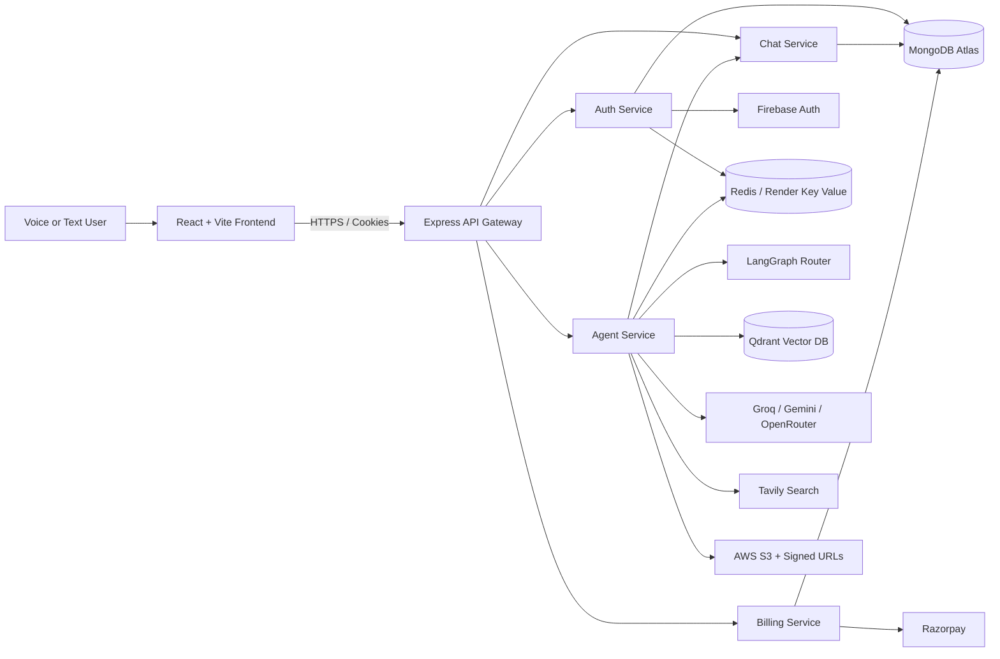

# ModeMesh AI

<div align="center">
  

  <h3>Multi-Agent Voice & Text AI Workspace</h3>

  <p>
    A production-deployed MERN platform that routes natural-language requests to specialized AI agents for conversation, live web research, coding, PDF RAG, image understanding, document generation, and more.
  </p>

  <p>
    <a href="https://modemesh-vedang.onrender.com"></a>
    <a href="https://github.com/codeVedang/mode-mesh/actions/workflows/deploy.yml"></a>
  </p>

  <p>
    
    
    
    
    
    
  </p>
</div>

---

## Live product

**Application:** [https://modemesh-vedang.onrender.com](https://modemesh-vedang.onrender.com)

Sign in with Google and choose one of two purpose-built experiences:

- **Voice Mode** — an Alexa/Siri-style conversational loop that greets the user, listens, detects silence, submits automatically, speaks the answer, resumes listening, and supports interruption.
- **Text Mode** — a full AI workspace with agent selection, persistent conversations, Markdown answers, code highlighting, file upload, generated artifacts, and billing controls.

> Render free services can sleep after inactivity. The browser prewarms all downstream services in parallel, API calls wait for the service they need, and the gateway retains scoped cold-start retries. The first request can still take longer than usual while free instances start.

## Why this project stands out

- **Real multi-agent orchestration:** LangGraph classifies each request and routes it through a stateful graph of specialized agents.
- **Multimodal interaction:** hands-free voice, text chat, PDF upload, image analysis, image generation, and downloadable artifacts share one workspace.
- **Jarvis-style voice console:** a single-screen live transcript runs a continuous listen → route → answer → speak loop, supports interruption, and recognizes commands for repeat, mute, new conversation, and ending a session.
- **Production-oriented architecture:** an API gateway fronts four independently deployable services with internal service authentication.
- **End-to-end RAG:** uploaded PDFs are parsed, chunked, embedded, stored in Qdrant, retrieved by similarity, and answered with grounded context.
- **Multiple model providers:** Groq, Google Gemini, and OpenRouter are selected by workload instead of coupling the platform to one model.
- **Cloud-native delivery:** Docker images, Render Blueprint deployment, GitHub Actions, AWS ECR/ECS, S3, and CloudFront are represented in repository-managed deployment code.
- **Resilient free-tier deployment:** shared readiness checks, concurrent warming, scoped `503` retries, and user-friendly recovery reduce microservice cold-start failures.
- **Performance-focused delivery:** route-level workspace splitting keeps Monaco and chat tooling out of the initial login bundle, while agent persistence and Redis memory writes run concurrently.
- **Security-aware boundaries:** Firebase token verification, HTTP-only session cookies, Redis-backed sessions, CORS, private service tokens, environment-managed secrets, and signed S3 URLs.

## Product capabilities

| Area | Capability |
| --- | --- |
| Conversational voice | Jarvis-style single-screen transcript, wake phrases, continuous listening, silence-based auto-send, spoken replies, mute, repeat, new-session commands, and interruption |
| Intelligent routing | `Auto` mode uses an LLM router and LangGraph conditional edges to select the appropriate specialist |
| General assistant | Context-aware chat with Redis-backed short-term memory and persistent MongoDB conversation history |
| Live research | Tavily web search feeds current results into the answer-generation agent |
| Coding workspace | Code generation, debugging, review, explanation, optimization, conversion, documentation, and Monaco-based artifact preview |
| PDF RAG | PDF parsing, recursive chunking, Gemini embeddings, Qdrant similarity search, and source-grounded answers |
| Image intelligence | Gemini multimodal analysis for uploaded images, including text, chart, and table interpretation |
| Content generation | Downloadable PDF and PowerPoint generation with temporary signed links |
| Image generation | Prompt enhancement, Pollinations image generation, S3 storage, and signed downloads |
| Authentication | Firebase Google OAuth on the client and Firebase Admin token verification in the auth service |
| Monetization | Razorpay order verification, subscription plans, credits, and per-agent usage costs |
| Conversation UX | Globally loaded and recency-sorted conversation history, Markdown/GFM rendering, syntax highlighting, copy actions, loading states, and responsive UI |

## Multi-agent graph

ModeMesh currently compiles eight specialist nodes plus an LLM-powered router:

| Agent | Responsibility | Primary integration |
| --- | --- | --- |
| Router | Classifies requests and selects the workflow | LangGraph + Groq |
| Chat | General answers and contextual follow-ups | Groq + Redis memory |
| Search | Retrieves current web information, then hands results to Chat | Tavily + Groq |
| Coding | Generates project artifacts or handles code review/debugging | OpenRouter + Monaco |
| PDF | Produces structured downloadable PDF documents | Groq + PDFKit + S3 |
| PPT | Produces six-slide downloadable presentations | Groq + PptxGenJS + S3 |
| Vision | Generates and stores requested images | Pollinations AI + S3 |
| PDF RAG | Answers questions from an uploaded PDF | pdf-parse + Gemini Embeddings + Qdrant |
| Image Analyzer | Understands uploaded images | Gemini 2.5 Flash |

## Architecture



### Request lifecycle

1. Firebase signs in the user and sends an ID token to the gateway.
2. The auth service verifies the token and creates an HTTP-only, Redis-backed session.
3. The gateway validates the session and forwards the user ID plus an internal service token.
4. The agent service invokes the LangGraph workflow.
5. The router chooses a specialist from the prompt and optional uploaded file.
6. Results and artifacts are saved through the chat service and returned to the selected voice or text interface.

## Microservices

| Service | Responsibility | Local port convention | Live health endpoint |
| --- | --- | ---: | --- |
| API Gateway | CORS, cookies, session protection, service proxying, cold-start coordination | `8000` | [Gateway](https://modemesh-vedang-api.onrender.com/) |
| Auth | Firebase verification, user creation, sessions, plans, and credits | `8001` | [Auth](https://modemesh-vedang-auth.onrender.com/) |
| Chat | Conversations and persistent message history | `8002` | [Chat](https://modemesh-vedang-chat.onrender.com/) |
| Agent | LangGraph orchestration, RAG, generation, search, and file processing | `8003` | [Agent](https://modemesh-vedang-agent.onrender.com/) |
| Billing | Razorpay orders, signature verification, and payment records | `8004` | [Billing](https://modemesh-vedang-billing.onrender.com/) |

Internal service routes require a shared `x-internal-service-token`; only health endpoints remain public.

## Complete technology stack

### Languages and runtime

- JavaScript with ES Modules
- Node.js 22
- HTML5 and custom responsive CSS
- JSON, YAML, Dockerfile, and PowerShell deployment tooling

### Frontend frameworks and libraries

| Technology | Use in ModeMesh |
| --- | --- |
| React 19 / React DOM | Component-based single-page application |
| Vite 8 | Development server and optimized production build |
| Redux Toolkit / React Redux | User, conversation, message, artifact, and loading state |
| Axios | Credentialed API client with scoped cold-start retry interceptor |
| Firebase Web SDK | Google OAuth sign-in |
| Web Speech API | `SpeechRecognition`/`webkitSpeechRecognition` and `speechSynthesis` voice loop |
| Monaco Editor React | Generated code artifact editor and preview workspace |
| Motion for React | Drawer and artifact UI transitions |
| React Markdown + remark-gfm | Markdown and GitHub-Flavored Markdown rendering |
| React Syntax Highlighter / Prism | Language-aware code blocks |
| React Icons / Lucide React | Interface icon systems |
| Tailwind CSS Vite plugin | Utility-CSS toolchain support alongside custom CSS |
| Google Fonts | Manrope, Instrument Serif, and JetBrains Mono typography |

### Backend, APIs, and security libraries

| Technology | Use in ModeMesh |
| --- | --- |
| Express 5 | API gateway and all backend services |
| express-http-proxy | Gateway-to-microservice forwarding |
| Mongoose | MongoDB models and persistence |
| ioredis | Sessions, message memory, and agent usage/rate data |
| Firebase Admin | Server-side Firebase ID-token verification |
| cookie-parser | HTTP-only session cookie handling |
| CORS | Restricted credentialed frontend access |
| Morgan | Gateway HTTP logging |
| Multer | PDF/image upload, limits, and MIME validation |
| dotenv | Local environment configuration |
| Axios | Internal service calls and external binary downloads |
| Nodemon | Local service development |

### AI, agents, and RAG

| Technology | Use in ModeMesh |
| --- | --- |
| LangGraph | Stateful graph, nodes, edges, and conditional agent routing |
| LangChain Core | Message abstractions and LLM workflow primitives |
| LangChain Groq | Chat, routing, research synthesis, and document planning |
| LangChain Google GenAI | Gemini multimodal analysis and embeddings |
| LangChain OpenRouter | Coding agent model access |
| LangChain Tavily | Current web search with image results |
| LangChain Qdrant | Vector-store ingestion and similarity retrieval |
| LangChain Text Splitters | Recursive PDF chunking with overlap |
| Google Generative AI SDK | Direct Gemini provider SDK available alongside the LangChain integration |
| Qdrant | Vector database for document RAG |
| Groq | `openai/gpt-oss-120b` inference route |
| Google Gemini | `gemini-2.5-flash` and `gemini-embedding-001` |
| OpenRouter | Configurable coding model with a free-model fallback |
| Tavily | Search API for recent information |
| Pollinations AI | Generated-image endpoint |

### Files, artifacts, payments, and data

| Technology | Use in ModeMesh |
| --- | --- |
| MongoDB Atlas | Users, conversations, messages, and payments |
| Redis / Render Key Value | Sessions, cached memory, and agent limits |
| AWS S3 | Private generated files and images |
| AWS SDK for JavaScript | Object upload and access |
| S3 Request Presigner | Expiring download links |
| pdf-parse | Uploaded PDF text extraction |
| PDFKit | Programmatic PDF generation |
| PptxGenJS | Programmatic PowerPoint generation |
| Razorpay | Checkout, order creation, and payment verification |

### Cloud, DevOps, and engineering tools

- **Render Blueprint:** live static frontend, gateway, four web services, environment wiring, and Redis-compatible Key Value.
- **Docker:** an individual Dockerfile for the gateway and every microservice.
- **Docker Compose:** local Redis service.
- **GitHub Actions:** manual AWS deployment workflow that builds and pushes service images, refreshes ECS services, builds the frontend, syncs it to S3, and invalidates CloudFront.
- **AWS ECR / ECS:** container registry and service deployment target supported by the workflow.
- **AWS S3 / CloudFront:** frontend hosting target supported by the workflow; S3 also stores generated artifacts.
- **ESLint:** React, Hooks, and refresh-aware static analysis.
- **Vite React plugin / Tailwind Vite plugin:** React Fast Refresh and build-time Tailwind integration.
- **npm, Git, and GitHub:** dependency management and version control.
- **PowerShell:** local secret-distribution helper for multi-service development.

## Deployment strategy

### Current live environment — Render

[`render.yaml`](render.yaml) defines the complete live topology:

- one global static Vite site;
- one public API gateway;
- four private-token-protected Node.js microservices;
- one Redis-compatible Render Key Value instance;
- generated and manually supplied environment variables;
- automatic deployment on commits.

### AWS deployment path — GitHub Actions

The manual [AWS deployment workflow](.github/workflows/deploy.yml) supports a second production architecture:

1. Configure AWS credentials.
2. Build five Docker images.
3. Push the images to Amazon ECR.
4. Force new Amazon ECS service deployments.
5. Build the Vite frontend.
6. Sync the build to S3.
7. Invalidate the CloudFront distribution.

## Local development

### Prerequisites

- Node.js 22+
- npm
- Docker Desktop or a reachable Redis instance
- MongoDB Atlas or local MongoDB
- Provider credentials for the features you want to run

### Install

```bash
git clone https://github.com/codeVedang/mode-mesh.git
cd mode-mesh

npm install --prefix frontend
npm install --prefix backend
npm install --prefix backend/gateway
npm install --prefix backend/services/auth
npm install --prefix backend/services/chat
npm install --prefix backend/services/agent
npm install --prefix backend/services/billing
```

Start local Redis:

```bash
docker compose -f backend/docker-compose.yml up -d
```

### Environment variables

Never commit secrets. `.env*`, Firebase Admin JSON files, PEM files, and `deployment-secrets.local.env` are ignored by Git.

| Scope | Variables |
| --- | --- |
| Frontend | `VITE_SERVER_URL`, `VITE_AUTH_SERVICE_URL`, `VITE_CHAT_SERVICE_URL`, `VITE_AGENT_SERVICE_URL`, `VITE_BILLING_SERVICE_URL`, `VITE_FIREBASE_API_KEY`, `VITE_RAZORPAY_KEY_ID` |
| Gateway | `PORT`, `FRONTEND_URL`, `AUTH_SERVICE`, `CHAT_SERVICE`, `AGENT_SERVICE`, `BILLING_SERVICE`, `REDIS_URL`, `INTERNAL_SERVICE_TOKEN` |
| Auth | `PORT`, `NODE_ENV`, `MONGODB_URI`, `REDIS_URL`, `FIREBASE_SERVICE_ACCOUNT_JSON`, `INTERNAL_SERVICE_TOKEN` |
| Chat | `PORT`, `NODE_ENV`, `MONGODB_URI`, `INTERNAL_SERVICE_TOKEN` |
| Agent | `PORT`, `NODE_ENV`, `MONGODB_URI`, `REDIS_URL`, `INTERNAL_SERVICE_TOKEN`, `GROQ_API_KEY`, `GOOGLE_API_KEY`, `OPENROUTER_API_KEY`, `OPENROUTER_MODEL`, `TAVILY_API_KEY`, `QDRANT_URL`, `QDRANT_API_KEY`, `AWS_REGION`, `AWS_ACCESS_KEY_ID`, `AWS_SECRET_KEY`, `AWS_BUCKET_NAME`, `AUTH_SERVICE`, `CHAT_SERVICE` |
| Billing | `PORT`, `NODE_ENV`, `MONGODB_URI`, `RAZORPAY_KEY_ID`, `RAZORPAY_KEY_SECRET`, `AUTH_SERVICE`, `INTERNAL_SERVICE_TOKEN` |

The local `scripts/distribute-secrets.ps1` helper can map a private root secret file into service-specific `.env` files. See [DEPLOYMENT.md](DEPLOYMENT.md) for Render setup and provider configuration.

### Run

Open separate terminals for the services:

```bash
npm run dev --prefix backend/services/auth
npm run dev --prefix backend/services/chat
npm run dev --prefix backend/services/agent
npm run dev --prefix backend/services/billing
npm run dev --prefix backend/gateway
npm run dev --prefix frontend
```

## Quality checks

```bash
npm run lint --prefix frontend
npm run build --prefix frontend
node --check backend/gateway/index.js
node --check backend/gateway/utils/proxyWithHeader.js
```

## Repository structure

```text
mode-mesh/
├── .github/workflows/        # AWS GitHub Actions deployment
├── backend/
│   ├── gateway/              # Public API gateway
│   ├── services/
│   │   ├── auth/             # Identity, sessions, users, credits
│   │   ├── chat/             # Conversations and messages
│   │   ├── agent/            # LangGraph, agents, RAG, artifacts
│   │   └── billing/          # Razorpay and payment records
│   ├── shared/               # Redis and internal-service security
│   └── docker-compose.yml    # Local Redis
├── frontend/                 # React/Vite voice and text workspace
├── scripts/                  # Local secret tooling
├── render.yaml               # Live Render Blueprint
└── DEPLOYMENT.md             # Deployment runbook
```

## Engineering highlights for reviewers

- Clear separation between gateway, identity, chat persistence, AI orchestration, and billing.
- Conditional graph routing rather than one oversized prompt or controller.
- Provider abstraction allows different models for conversation, coding, vision, and embeddings.
- Retrieval pipeline uses chunk overlap and top-k semantic search for grounded PDF answers.
- Generated artifacts are private by default and shared through expiring S3 URLs.
- Browser voice uses no additional paid speech API.
- Render and AWS deployment options demonstrate both rapid PaaS delivery and container-based cloud deployment.

---

<div align="center">
  <strong>Built by <a href="https://github.com/codeVedang">Vedang Tripathi</a></strong><br />
  <a href="https://modemesh-vedang.onrender.com">Try ModeMesh AI live</a>
</div>
